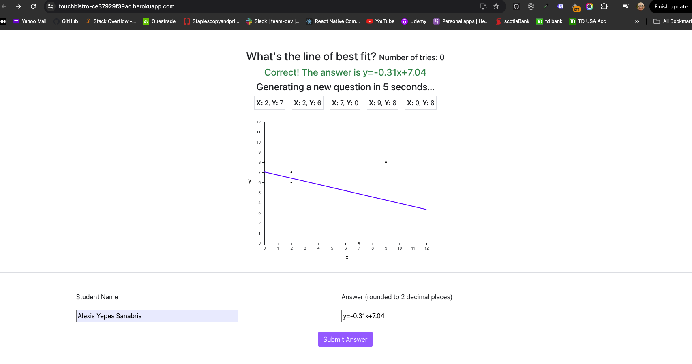

# TouchBistro Full Stack - Developer Challenge

## Questions from the [Google Doc](https://docs.google.com/document/d/1SGeYSqi6jwlMXxIwcbnST-xcoZQgXUWEeN2t5u9vJAk/edit):

1. Do you have production experience with Node prior to the submission of this code? If yes, for how long?  
   - Yes, I have about 7 years of experience working with Node
2. Do you have production experience with React prior to the submission of this code? If yes, for how long?
   - Yes, I have about 7 years of experience working with React applications.
3. Your full name (to ensure we can map back your submission to your resume)
   - ALEXIS YEPES SANABRIA

# General Documentation

Problem Statement:  
A teacher wants to know how well their students understand the line of best fit unit they are learning...([view more](https://docs.google.com/document/d/1SGeYSqi6jwlMXxIwcbnST-xcoZQgXUWEeN2t5u9vJAk/edit))

## Technologies

- NodeJs
- Postgres
- React
- Jest

## Local Installation

1. Clone the Github Repository locally (https://github.com/alexisyepes/touchbistro-challenge)
2. Navigate to the root of the project and run `npm install`. This command will install all the dependencies on both, backend and frontend.
3. Please refer to the file located at `config/config.json` which contains the database configuration.
4. Create a database in Postgres and make sure the connection setting match the data from step 3.
5. Start the application by running `npm start` from the root of the project. This command will start the backend server on port 3001 and the frontend server on port 3000.

## Database Tables Relation

- Students => Has many Submissions
- Questions => Has many Submissions
- Submissions => Belongs to Questions, Belongs to Students

## Live postgres database configuration (!Outdated)

- Host:
  c5hilnj7pn10vb.cluster-czrs8kj4isg7.us-east-1.rds.amazonaws.com
- Database:
  d5avme7lvkggfq
- User:
  ue94uk9lhbk252
- Port:
  5432
- Password:
  p318ca3458b886008a8f7b1622910d32ac04e70e08fbc3a7dec5a39088f3080e1

